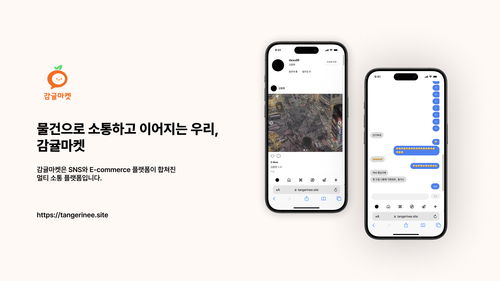
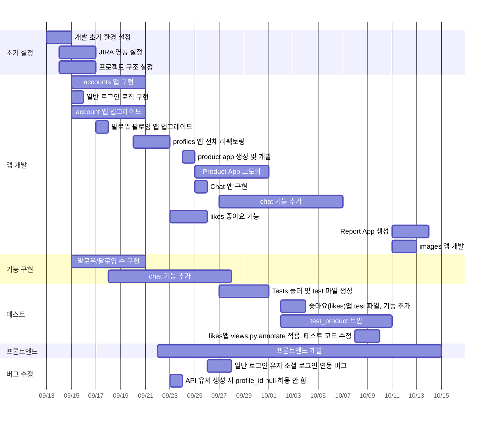
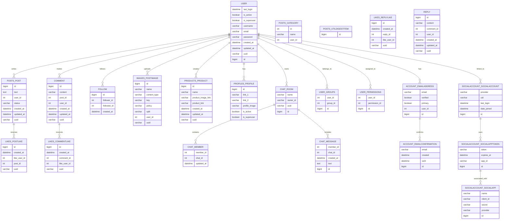
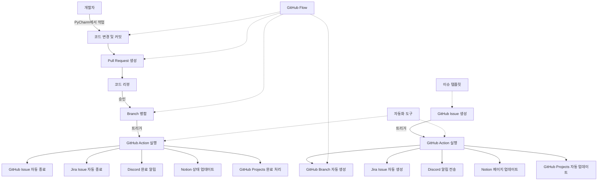

<div align="center">
  <p align="center">
    
  </p>
</div>

## 목차
- [1. 🍊 프로젝트 개요](#1--프로젝트-개요)
- [2. 👨‍⚕️ 팀 & 팀원 소개](#2--팀-&-팀원-소개)
- [3. 📐 프로젝트 설계](#3--프로젝트-설계)
- [# 4. 📚 기술스택](#4--기술스택)

# 1. 🍊 프로젝트 개요

&nbsp;&nbsp;&nbsp;&nbsp;&nbsp;&nbsp;&nbsp;&nbsp;&nbsp;&nbsp;&nbsp;&nbsp;&nbsp;&nbsp;&nbsp; 등 백엔드, 프론트엔드, ML 분야의 다양한 기술이 집약된 SNS, $\bf{\color{#F26E22}감귤마켓}$입니다.

### 1.1. 목적(컨셉)

- $\bf{\color{#F26E22}감귤마켓}$ 은 외부 스토어에서 판매하고 있는 상품을 등록하여 홍보할 수 있는 SNS입니다.
- **주 타겟** 판매 및 구매에 관심있는 사람들입니다.
- **부 타겟** SNS를 통해 일상을 공유하고 소통하고자 하는 모든 사람들입니다.

**개발기간**: 2024.9.23.(월) ~ 10.14.(월), 22일 간

**우리가 이번 프로젝트에서 도전했던 것**: **Backend, Frontend, ML**의 긴밀한 통합

**URL**: https://tangerinee.site

**결과**: 🥇 부트캠프 프로젝트 대상

</br>

# 2. 👨‍⚕️ 팀 & 팀원 소개

### 2.1. 💬 팀 소개

조화와 지속 가능한 성장을 추구하는 팀 $\bf{\color{#F26E22}감귤조직}$ 입니다.

팀 개개인 모두 주어진 위치에 상관없이 모든 일에 오너십을 가지고 적극적으로 참여하는 것을 최우선으로 생각하고 있으며, 지금도 좋은 동료가 되기 위해 **치열하게 고민하고, 학습하고, 성장하고 있습니다**.

<br>

### 2.2. 👨‍⚕️ 멤버 소개

| **공미희**                                                              | **권용인**                                                                | **김동현**                                                                                        |
|----------------------------------------------------------------------|------------------------------------------------------------------------|------------------------------------------------------------------------------------------------|
| 백앤드 (Products/Reports/tests) 및 문서, Figma Slide                       | 백앤드 (Likes, images), 이슈 해결 및 문서 작성                                     | 백엔드(accounts/ api / channels / chats / comments / posts / follows ), 프론트엔드, PM      |
| [https://github.com/heeeee-github](https://github.com/heeeee-github) | [https://github.com/vanhalenpanama](https://github.com/vanhalenpanama) | [https://github.com/ds5105119](https://github.com/ds5105119)                                   |
| 데이터 분석 및 웹페이지 개발을 좋아합니다.                                             | 데이터 분야에 관심이 많습니다.                                                      | CS/CE의 전반적인 분야에 흥미를 갖고 있습니다. 단국대학교 SW학부를 특기자 전형 수석으로 입학하였습니다. |

<br>

### 2.3. 👨🏼‍💻 업무 분담

**김동현(팀장)**

- **프로젝트 관리 및 DevOps**
    - Jira와 GitHub를 활용한 프로젝트 협업 및 관리 프로세스 구축
    - VCS 환경에서 pre-commit 및 GitHub Actions 설정으로 자동화된 코드 검증 및 CI/CD 파이프라인 구축 및 배포
- **백엔드 개발**
    - 회원(Accounts), 포스팅(Posts) 및 채팅(Chats) 등 핵심 앱 구현
    - Boto3를 활용한 데이터 교환 로직 개발
    - Apache Pulsar를 Channels가 지원할 수 있도록 **Channel Pulsar** 파이썬 패키지 개발 및 구현
    - 전체 백엔드의 Docker 컨테이너화 및 Poetry 도입으로 의존성 관리 및 AWS 배포
- **머신러닝**: Milvus DB 도입 및 유사도 검색 기능 구현(vector embedding 기반)
- **프론트엔드 개발**: Next.js를 사용한 전체 프론트엔드 구현 및 UI/UX 설계
- **디자인**: Figma를 사용한 컴포넌트, IR 디자인 및 문서 디자인
- **그 외**: 전체적인 문서 검토, 컨벤션 수립 및 전체 아키텍쳐 설계 

**권용인**

- **백엔드 개발**
    - 좋아요(likes) 앱
        - 게시글, 댓글, 답글에 대한 좋아요 모델 개발
        - 좋아요 CRUD API 구현
    - 이미지(images) 앱
        - **OpenCV**를 활용한 이미지 처리 로직 구현: 리사이징 및 압축
        - AWS S3 연동: Boto3로 Presigned POST URL을 이용한 안전한 파일 업로드 로직 개발
- **문서 작업**
    - Notion을 활용한 프로젝트 문서 관리
        - API 엔드포인트 문서화
        - 데이터베이스 스키마 및 모델 관계도 작성

**공미희**

- **백엔드 개발**
    - 상품(Products) 앱
        - ViewSet 및 ModelSerializer를 활용한 CRUD 엔드포인트 설계
        - Custom permission classes 개발로 세분화된 접근 제어 구현
    - 신고(Reports) 앱
        - 신고 처리 워크플로우 설계 및 개발
        - 관리자 대시보드를 위한 신고 통계 API 구현
    - **pytest** 를 통한 테스트 작성 및 관리
        - conftest.py를 통한 테스트 픽스처 관리
        - 각 앱별 test 파일 작성 등 체계적인 테스트 구조 확립
- **문서 작업 및 프레젠테이션**
    - Notion을 활용한 프로젝트 문서 작성 및 관리
    - Figma를 활용한 프로젝트 슬라이드 제작 및 발표

</br>

# 3. 📐 프로젝트 설계

## 3.1. 🗞️ 아키텍쳐
<p align="center">
  
</p>

## 3.2. 📅 Work breakdown structure
모든 일정은 **Jira**를 통해 체계적으로 관리되었습니다.



## 3.3. 🖌️ Entity Relationship Diagram


🔗 <a href src="https://github.com/ds5105119/tangerineAPI/blob/TG-127--issue-148/readme_img/tangerine-erd.png?raw=true">이미지로 보기</a>

## 3.4. 화면

<p align="center">
  
</p>

</br>

# 4. 📚 기술스택

## 4.1. 환경(Environment)

1. **IDE: Pycharm, VSCode**
   1. 두 IDE 모두 VCS 및 Jira와의 원활한 통합 지원하여 생산성을 높였습니다.
2. **언어(Language): Python, TypeScript**
   1. **Poetry**를 사용하여 파이썬 패키지를 효율적으로 관리하였습니다.
3. **프로젝트 관리(Project Management System): Jira**
   1. 프로젝트 관리에 집중할 수 있도록 체계적인 개발 환경을 조성하였습니다.
4. **🖇️ GitHub Actions와 Jira 자동화**를 통해 다양한 상용 프로그램과 통합된 환경을 구축하였습니다.
   1. GitHub issue 생성 시 자동으로 branch가 생성되며, Jira는 해당 이슈를 자동으로 추적합니다. branch가 병합되면 Jira issue와 GitHub issue도 자동으로 종료됩니다.
   2. **연동된 도구**: Github issue, Github branch, Discord via webhooks, Email, Notion, Pycharm, Jira Automation
5. **버전 관리(Version Control System): Github**
    1. 🛠️ 깃허브 액션 등 다양한 기능 사용
        1. Github Projects에서 Issue가 자동으로 추적됩니다.
        2. Jira와의 완벽한 통합
        3. 세심하게 이슈 템플릿을 사용하였습니다.
    2. 🏗️ Github flow branch 전략 채택
        1. ✨ Lightspeed Development
6. **지속적 통합 및 지속적 배포(CI/CD)**
    1. **Python: pre-commit**
        1. 📝 **pre-commit hooks**을 사용하여 코드 품질을 사전에 점검하였습니다.
        2. ⚡️ **Ruff**를 사용하여 매우 빠른 파이썬 코드 linting 및 formatting
        3. 🧪 **Pytest**를 통한 테스트 자동화로 코드 안정성을 유지하였습니다.
    2. **Frontend: Prettier**를 사용하여 코드 일관성 유지하였습니다.
    3. **☁️ AWS**
        1. ECR, ECS등의 AWS 서비스를 사용하여 **CI Pipeline을 구축**하였습니다.
7. **비용 최적화(Cost Optimization)**
    1. **AWS Spot Instance**
        1. 초기 서버 비용의 약 65%를 절감하였습니다.
    2. Django ORM의 Subquery, Prefetch 등 다양한 메서드를 통해 DB히트를 최소화하였습니다.
8. 전체 개발 프로세스


</br>

## 4.2. 개발(Development)

### 4.2.1. 백엔드(Backend): Django

1. **RESTful API 구축**
   1. **Django Rest Framework** 를 사용하여 안정적이고 효율적인 RESTful API 서버를 구축하였습니다. 클라이언트와의 원활한 데이터 통신을 지원합니다.
2. **소셜 인증(Django Allauth)**
   1. **Django Allauth** 와 **DJ-Rest-Auth** 를 통해 소셜 인증 제공업체와의 통합을 구현하였습니다. 사용자는 소셜 계정을 통해 편리하게 로그인할 수 있으며, 개발자는 복잡한 인증 로직을 단순화할 수 있습니다.
   2. 전용 **Adapter와 Serializer 등 다양한 커스텀된 로직** 을 작성하여 프로젝트에 긴밀하게 융합될 수 있도록 하였습니다.
3. **JWT 인증**
   1. **DjangoRestFramework-SimpleJWT** 를 활용하여 JSON Web Token (JWT) 인증을 구현하여 서버의 부하를 줄이고, stateless한 인증 메커니즘을 제공합니다.
4. **파일 업로드**
   1. **Boto3** 를 사용하여 S3 호환 스토리지에 대해 업로드 URL을 생성하고 이를 전달하는 API가 있습니다.
   2. **OpenCV**를 사용하여 이미지를 처리하는 API 또한 구현되어 있습니다.
   3. **Presigned POST URL** 을 생성하여 사용자가 특정 시간 동안 안전하게 파일을 업로드할 수 있도록 합니다.
5. **Channels Pulsar 기반 실시간 채팅 기능 구현**
   1. **Apache Pulsar**를 기반으로 하는 Channels의 <a href="https://github.com/ds5105119/tangerineAPI/tree/main/channels_pulsar2">Custom Channel Layer</a> 패키지를 개발하고, <a href="https://channels.readthedocs.io/en/stable/topics/channel_layers.html">Django Channels</a>를 활용하여 비동기 WebSocket API를 통해 실시간 채팅 기능을 구현하였습니다.
   2. Channels 라이브러리에서 프로덕션 용으로 제공하는 **Redis 기반 Channel Layer**는 채팅방 단위로 메시지를 관리하는 것이 일반적이며 이전 메시지를 불러오기 위해서는 DB에 저장하는 과정 또한 필요합니다. 이번 프로젝트에서 개발된 **Channel Pulsar**라이브러리는 **비동기, 멀티쓰레드, 분산 처리 환경**을 지원하는 더 효율적이고 유연한 구조를 제공합니다. 채팅방 단위가 아닌, 유저 별로 컨슈머가 구분되어 방을 전환할 때 마다 웹소켓 연결을 다시 수립할 필요가 없고 Zookeeper에 메시지가 저장되므로 DB히트 또한 줄어듭니다.
   3. **성능 최적화**
      1. 기본적으로 단일 서버에서 수백만 개의 메시지를 처리할 수 있는 고성능 아키텍처를 가지고 있으며, 메시지 발행 및 구독 처리 시 낮은 지연(latency)을 유지합니다.
      2. 만료된 채널/그룹 청소 및 Pulsar 프로듀서/컨슈머 관리를 처리합니다. (파일 경로: channels_pulsar2/layer.py)
      3. **Pulsar** 는 웹 소켓(WebSocket)과의 자연스러운 통합이 가능합니다. 각 사용자가 웹 소켓을 통해 실시간으로 메시지를 구독하고, 개별 사용자의 구독 상태를 관리할 수 있는 구조를 제공하기 때문에, 연결이 해제되거나 재연결되더라도 안정적으로 메시지를 전송할 수 있습니다.
      4. **백 프레셔 처리**
         1. 과부하 상황에서도 안정적인 메시지 처리가 가능합니다.
6. **쿼리 최적화**
    1. 데이터베이스 쿼리를 최적화하고, 필요한 데이터를 미리 로드하여 성능을 향상시킵니다.
    2. **F함수**: 쿼리 최적화를 위하여 Django ORM에서 필드 값을 직접 참조하고, 쿼리셋에서 연산을 수행하는 기능을 사용합니다.
    3. **Prefetching**
        1. **`select_related()`** : 현재 참여하고 있는 채팅방을 미리 로드하여 추가적인 데이터 조회를 방지하였습니다.
        2. **`prefetch_related(Prefetch())`** : 채팅방에 존재하는 여러 멤버와 멤버들의 프로필 정보를 미리 가져와 성능을 최적화합니다.
    4. 그 외, DB 인덱스 등 다양한 쿼리 질의를 최적화하기 위해 노력하였습니다.
7. DRF **Viewset**
    1. Viewset을 사용하여 코드 중복을 줄이고, RESTful API 설계 또한 간소화하였습니다.
    2. 코드 재사용성과 유지보수성을 높이고, 다양한 요청을 일관된 방식으로 처리하여 개발 속도와 API 확장성을 향상시켰습니다.
    3. lookup_field와 같은 뷰셋의 필드를 사용해 효율적으로 엔드포인트를 관리하였습니다.
8. **Pagination**
    1. 대량의 데이터를 한 번에 전달하지 않고, 페이지 단위로 나누어 응답 속도와 서버 성능을 최적화하였습니다.
    2. 클라이언트가 필요한 데이터만 효율적으로 가져와 사용자 경험과 성능을 모두 향상하여 서버 부하를 줄일 수 있습니다.
    3. **PageNumberPagination, CursorPagination**을 사용하여 요청에 따라 데이터를 일정량씩 반환하도록 설정하였습니다.

### 4.2.2. 프론트엔드(Frontend): Next.js
1. **React Query**
    1. useQuery, useMutation등 다양한 훅을 사용하여 서버와의 통신, 데이터 캐싱 및 동기화를 관리하였습니다. 
    2. useInfiniteQuery 훅과 Intersection Observer 라이브러리의 useInView 훅을 사용하여 무한 스크롤을 구현하였습니다.
2. **컴포넌트 재사용성(Class Variance Authority)**
    1. **CVA** 를 사용하여 UI 컴포넌트의 재사용성을 높여 개발 효율성을 개선하고, 일관된 사용자 인터페이스를 제공합니다.
3. **이미지 최적화**
    1. **`Next/Image** 컴포넌트`** 를 사용하여 이미지 최적화를 통해 페이지 로딩 속도를 개선하였습니다.
4. **HTTP 통신**
    1. **Axios** 인스턴스와 interceptor를 사용하여 인증 정보를 자동으로 전송하고
5. **WebSocket**
    1. WebSocket을 사용하여 실시간 데이터 통신을 구현하고, 사용자와의 상호작용을 강화합니다.
6. **Zustand**
    1. 전역 상태를 라이브러리로 Zustand를 채택하였습니다.
    2. Zustand는 보일러 코드가 적어 사용하기 쉽고 가벼워 WebSocket, 계정 정보 등의 관리에 사용되었습니다.
    3. 전역적으로 관리되는 WebSocket과 별도 개발된 Channels Pulsar 패키지는 효율적으로 웹소켓 연결을 관리합니다.

### 4.2.3. 머신러닝(ML)
1. **Milvus 클라이언트를 통한 유사도 검색**
   1. 사용자 맞춤형 추천 시스템, 검색 엔진 구현을 위해 사용되었습니다.
   2. 사용자의 요청 정보, 클라이언트 측 화면에서의 콘텐츠 소비 시간을 바탕으로 게시물을 추천하는 시스템을 개발하였습니다.
   4. 주어진 검색어 또는 사용자의 히스토리를 임베딩으로 변환한 후 Milvus 데이터베이스에서 유사도 검색을 한 뒤, DB에서 정보를 찾아 반환하는 과정으로 구현되었습니다.

</br>

### 협업 방법
 1. **Jira**

    - 필요한 업무 문서화
    <p align="center">
      
    </p>

    - 자동으로 연동되는 이슈
    <p align="center">
      
    </p>


 2. **github CodeQL**을 사용한 보안 취약점 탐지
    <p align="center">
      
    </p>


 3. 지속 가능한 **코드 리뷰 문화** 구축
    <p align="center">
      
    </p>


 4. **용도별 이슈 템플릿** 작성
    <p align="center">
      
    </p>


 5. **Notion**
    <p align="center">
      
    </p>

</br>

### 시연 영상
</br>

### 주요 기능

**🍊 회원 정보**

- **소셜계정(google)을 활용한 회원가입 및 로그인**
- **프로필 관리**
    - 사용자 정보 조회 및 수정
    - 작성 글/댓글 목록

**🍊 상품**

- **(C)** 상품 명, 가격, 이미지 및 판매 링크(외부 URL)
- **(R)** 등록된 상품 목록 및 상세 조회
    - 무한 스크롤로 이전 글 읽기
- **(U/D)** 작성자 본인에 한해 등록한 상품 글 수정 및 삭제

**🍊 게시글**

- **(C)** 제목, 내용, 이미지, 태그, 조회수 및 좋아요 수 확인
- **(R)** 홈피드에서 팔로우한 사용자의 게시글 조회
    - 무한 스크롤로 이전 게시글 읽기
- **(U/D)** 작성자 본인에 한해 등록한 게시글 수정 및 삭제

**🍊 소셜**

- **팔로우/언팔로우**
    - 다른 사용자 팔로우 및 언팔로우
    - 팔로워 및 팔로잉 목록 조회
- **좋아요**
    - 게시글 좋아요 누르기 및 취소
    - 좋아요를 누른 사용자 목록 확인
    - 프로필에서 좋아요 누른 게시글 확인
- **댓글**
    - 게시글에 댓글 작성, 조회, 수정 및 삭제
    - 댓글의 답글
- **채팅**
    - 채팅방 생성 및 **나가기**
    - 참여중인 채팅방 목록 조회
    - 메시지 전송 및 수신(1:N 실시간 채팅)

**🍊 신고**

- 유저/게시글/댓글/채팅/상품 신고
- 신고 접수 및 처리 기능
    - 관리자에게만 권한을 부여

**🍊 검색**
- 사용자가 검색한 유사한 결과로 검색

</br>

## 트러블슈팅

1. **Alluth 호환성 문제**

    최신 버전에서 발생하는 호환성 문제를 해결하기 위하여 DJ-Rest-Auth의 Django Rest Framework와 Django Allauth를 통합하여 RESTful API에 대한 인증 기능을 사용하였습니다.
    `dj_rest_auth.registration.serializers.SocialLoginSerializer`를 상속받아 validate 함수를 수정하였습니다. 이로 인해 DJ-Rest-Auth의 업데이트에도 Robust하게 동작합니다.  (AllAuth 64.2.1 버전에서 65.0.1 버전으로 업그레이드 하여 정상적으로 동작함을 확인하였습니다.)
    ```
    파일 경로: accounts/serializers.py
   ```


2. **channels pulsar 패키지 개발 중 문제**

    channels pulsar 패키지는 비동기, 멀티 스레드, 분산 처리 환경을 염두에 두고 개발하였습니다. channels라이브러리의 message를 받는 부분에서 pulsar consumer의 recive함수로 함수의 제어권이 블로킹되는 현상이 있었습니다. `asyncio.to_thread`를 사용하여 별도의 스레드에서 실행하도록 하여 이를 해결하였습니다.

   ```
   파일 경로: channels_pulsar2/layers.py
   ```

3. **Vercel 배포 중 WebSocket 연결 불가 문제**

    서버리스 함수로 호스팅되는 특성 상 Vercel로 배포된 페이지는 WebSocket 연결을 지원하지 않았습니다.
    SSE만을 지원하여 EC2에서 next 앱을 build하고, pm2를 사용하여 무중단 배포를 구현하였습니다.

</br>

## 회고

- GitHub와 Jira를 활용한 **체계적인 프로젝트 관리**의 중요성을 깨달았습니다.

- 데이터베이스 쿼리 최적화, 코드 재사용성 향상, 보안 기능 구현 과정에서 **코드 모듈화의 필요성을 체감**하며 많은 것을 배웠습니다.

- RESTful API와 Pulsar 기반 실시간 채팅 시스템 구현을 통해 **확장 가능한 아키텍처 설계의 중요성을 직접 경험**했습니다.

- **CI/CD 파이프라인 구축**과 다양한 개발 도구 활용으로 생산성이 크게 향상되었고, **open CV, Milvus를 이용한 유사도 검색 구현**으로 성능을 개선한 시간 또한 뜻깊은 경험이었습니다.

- JWT와 Presigned POST URL을 활용한 **보안 강화 경험**은 실제 서비스 운영에 큰 도움이 될 것 같습니다.

- **AWS 서비스 활용**으로 클라우드 네이티브 개발에 대한 이해도 깊어졌습니다.

- **팀 협업**을 통해 코드 리뷰의 중요성을 인식하고 기술 리더십과 의사소통 능력도 향상되었습니다. 이번 프로젝트로 Django 개발의 기반을 다지고, 더 큰 규모의 프로젝트에 도전할 준비를 마쳤습니다. :)

### 개인 회고

**김동현**

어느때보다 정신없이 지나간 3주가 아닌가 싶습니다. 마지막날까지 밤새도록 작업에 몰두해주신 모든 팀원분들께 감사인사를 전합니다.

**권용인**

 프로젝트를 시작하기 전에는 막연하게 DRF generics를 활용하는 방법 외에는 생각하지 못했는데 이번 프로젝트를 통해 RESTful API에 대한 디자인, 보안을 생각한 접근, Read Only용도의 Serializer 작성 등 배우고 알게된 것이 많습니다.

 맡은 부분의 기능을 구현하는데 보람을 느껴서 시간이 가는 줄 모를 정도로 몰두할 수 있었고 Apache Pulsar를 활용한 실시간 채팅 기능과 Milvus DB를 체험해볼 수 있는 값진 경험을 얻게 되었습니다.

**공미희**

  백엔드 개발자로서 참여한 첫번째 프로젝트이자 Github, Jira 등 협업 툴과 Pycharm, Docker, AWS 등을 활용한 사용한 첫 팀프로젝트였습니다. 

  프로젝트 시작 당시 첫 번째 에러와 마주하였을 때, 해결 방법을 알 수 없는 막막한 상황과 실력에 비해 과한 프로젝트에 참여했다는 부담감이 생겼습니다. 그렇지만 포기하지 않고 에러 코드에서 원인을 찾는 방법, 연관된 코드에서 변경이 필요한 부분을 발견하고 수정하는 과정, 해결할 수 있는 또 다른 방법을 적용하는 과정을 거치며 자신감을 가지게 되었습니다. 에러를 즉각 해결하진 못하더라도 해결하려는 의지가 있으면 시간이 걸리더라도 해결할 수 있다는 생각을 가지게 되었고, 이후로는 시간을 단축할 수 있는 코드 작성 방법과 과정을 숙지할 수 있었습니다.

 개발환경 세팅부터 Django 프로젝트 생성, seliarlizer, permission 등 세분화 과정, opencv, milvus 등 기능 적용, 배포 등 전반적인 개발 과정에 직•간접적으로 참여할 수 있었던 뜻깊은 과정이었습니다.

 전반적으로 코드 수준을 향상 시켜준 팀장님을 포함하여 개발 마지막날까지 함께 해 준 용인님께 감사인사 드립니다 :)


# 기타
**프레젠테이션** : https://www.figma.com/slides/RSDOtRS8czig44KfS2KIsz/%EA%B0%90%EA%B7%A4%EB%A7%88%EC%BC%93?node-id=45-998&t=SbiKTlXGDagBqhHY-1

### API 명세서
API는 Swagger를 사용하여 관리하였으며, Postman을 사용하여 체계적으로 API 엔드포인트, 요청 및 응답을 테스트 하였습니다.

주소 : /api/schema/swagger-ui/

예시 엔드포인트

| **API 분류** | **엔드포인트** | **메서드** | **설명** | **권한** |
| --- | --- | --- | --- | --- |
| **Accounts** |  |  |  |  |
|  | `/accounts/google/login/` | POST | Google OAuth2를 통한 소셜 로그인 | AllowAny |
|  | `/accounts/users/{handle}/` | GET | 특정 사용자 정보 조회 | AllowAny |
|  | `/accounts/users/` | GET | 사용자 리스트 조회 | IsAuthenticated |
|  | `/accounts/users/{handle}/` | PATCH | 사용자 정보 부분 업데이트 | IsAuthenticated |
|  | `/accounts/users/{handle}/` | PUT | 사용자 정보 전체 업데이트 | IsAuthenticated |
|  | `/accounts/users/{handle}/` | DELETE | 사용자 삭제 | IsAuthenticated |
|  | `/accounts/password/reset/` | POST | 비밀번호 초기화 요청 | AllowAny |
|  | `/accounts/password/change/` | POST | 비밀번호 변경 | IsAuthenticated |
|  | `/accounts/login/` | POST | 이메일/비밀번호 로그인 | AllowAny |
|  | `/accounts/logout/` | POST | 로그아웃 | IsAuthenticated |
|  | `/accounts/token/refresh/` | POST | 토큰 갱신 | AllowAny |
| **Posts** |  |  |  |  |
|  | `/posts/p/` | POST | 게시글 생성 | IsAuthenticated |
|  | `/posts/p/{uuid}/` | GET | 게시글 상세 조회 | AllowAny |
|  | `/posts/p/{uuid}/` | PUT, PATCH | 게시글 수정 | IsAuthenticated |
|  | `/posts/p/{uuid}/` | DELETE | 게시글 삭제 | IsAuthenticated |
|  | `/posts/latest/` | GET | 최신 게시글 조회 | AllowAny |
|  | `/posts/latest/{handle}/` | GET | 특정 사용자의 최신 게시글 조회 | AllowAny |
|  | `/posts/presigned/` | POST | AWS S3 Presigned URL 요청 | IsAuthenticated |
| **Comments** |  |  |  |  |
|  | `/comments/` | GET, POST | 댓글 목록 조회 및 생성 | IsAuthenticated |
|  | `/comments/user/` | GET | 특정 사용자 댓글 목록 조회 | IsAuthenticated |
|  | `/comments/{id}/` | DELETE | 댓글 삭제 | IsAuthenticated |
| **Follows** |  |  |  |  |
|  | `/follows/` | POST | 팔로우 생성 | IsAuthenticated |
|  | `/follows/{handle}/follows/` | GET | 팔로우 목록 조회 | IsAuthenticated |
|  | `/follows/{handle}/followers/` | GET | 팔로워 목록 조회 | IsAuthenticated |
|  | `/follows/{handle}/unfollow/` | DELETE | 언팔로우 | IsAuthenticated |
|  | `/follows/{handle}/unfollower/` | DELETE | 팔로워 삭제 | IsAuthenticated |
| **Products** |  |  |  |  |
|  | `/products/` | POST | 상품 생성 | IsAuthenticated |
|  | `/products/` | GET | 상품 목록 조회 | AllowAny |
|  | `/products/{uuid}/` | GET | 상품 상세 조회 | AllowAny |
|  | `/products/{uuid}/` | PUT | 상품 업데이트 | IsAuthenticated |
|  | `/products/{uuid}/` | DELETE | 상품 삭제 | IsAuthenticated |
|  | `/products/recommend/` | GET | 추천 상품 조회 | AllowAny |
|  | `/products/latest/{handle}/` | GET | 특정 사용자의 최신 상품 조회 | AllowAny |
| **Likes** |  |  |  |  |
|  | `/likes/post-likes/` | POST | 게시글 좋아요 추가 | IsAuthenticated |
|  | `/likes/post-likes/{uuid}/` | DELETE | 게시글 좋아요 취소 | IsAuthenticated |
|  | `/likes/post-likes/` | GET | 게시글 좋아요 사용자 목록 조회 | IsAuthenticated |
|  | `/likes/comment-likes/` | POST | 댓글 좋아요 추가 | IsAuthenticated |
|  | `/likes/comment-likes/{uuid}/` | DELETE | 댓글 좋아요 취소 | IsAuthenticated |
|  | `/likes/comment-likes/` | GET | 댓글 좋아요 사용자 목록 조회 | IsAuthenticated |
|  | `/likes/comment-likes/{uuid}/` | GET | 댓글 좋아요 수 조회 | IsAuthenticated |
|  | `/likes/reply-likes/` | POST | 답글 좋아요 추가 | IsAuthenticated |
|  | `/likes/reply-likes/{uuid}/` | DELETE | 답글 좋아요 취소 | IsAuthenticated |
|  | `/likes/reply-likes/` | GET | 답글 좋아요 사용자 목록 조회 | IsAuthenticated |
|  | `/likes/reply-likes/{uuid}/` | GET | 답글 좋아요 수 조회 | IsAuthenticated |

</br>
