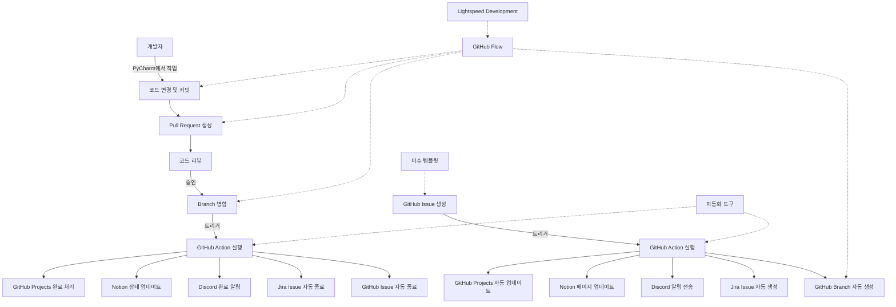

## 🍊 감귤마켓

<p align="center">
  
</p>
</br>

## **👨‍⚕️ 팀 & 팀원 소개**

### **💬 팀 소개**

조화와 지속 가능한 성장을 추구하는 **<font color="orange">감귤조직</font>** 입니다.

팀 개개인 모두 주어진 위치에 상관없이 모든 일에 오너십을 가지고 적극적으로 참여하는 것을 최우선으로 생각하고 있습니다.

지금도 좋은 동료가 되기 위해 **치열하게 고민하고, 학습하고, 성장하고 있습니다**.

### **👨‍⚕️ 멤버 소개**

| **공미희**                                                              | **권용인**                                                                | **김동현**                                                                                        |
|----------------------------------------------------------------------|------------------------------------------------------------------------|------------------------------------------------------------------------------------------------|
| 백앤드 (Products/Reports/tests) 및 문서, Figma Slide                       | 백앤드 (Likes, images), 이슈 해결 및 문서 작성                                     | 백엔드(accounts/ api / channels / chats / comments / posts / follows ), 프론트엔드 , PL      |
| [https://github.com/heeeee-github](https://github.com/heeeee-github) | [https://github.com/vanhalenpanama](https://github.com/vanhalenpanama) | [https://github.com/ds5105119](https://github.com/ds5105119)                                   |
| 데이터 분석 및 웹페이지 개발을 좋아합니다.                                             | 데이터 분야에 관심이 많습니다.                                                      | CS/CE의 전반적인 분야에 흥미를 갖고 있습니다. CS/CE의 전반적인 분야에 흥미를 갖고 있습니다.     XX대학교 SW학부를 특기자 전형 수석으로 입학하였습니다. |


### **👨🏼‍💻**업무 분담

**김동현(팀장)**

- **프로젝트 관리 및 DevOps**
    - Jira와 GitHub을 활용한 프로젝트 협업 및 관리 프로세스 구축
    - VCS 환경에서 pre-commit 및 GitHub Actions 설정으로 자동화된 코드 검증 및 CI/CD 파이프라인 구축
- **백엔드 개발**
    - 회원(Accounts) 및 채팅(Chats) 앱 등 핵심 기능 구현
    - R2와 Boto3를 활용한 데이터 교환 로직 개발
    - Apache Pulsar를 활용한 Channels Layer 지원 메시지 시스템 설계 및 구현
    - 전체 백엔드의 Docker 컨테이너화 및 Poetry 도입으로 의존성 관리
- **머신러닝**
    - Milvus DB 도입 및 유사도 검색 기능 구현
- **프론트엔드 개발**
    - React 기반 전체 프론트엔드 구현 및 UI/UX 설계
- **디자인**
    - 컴포넌트 디자인 및 문서화

**권용인**

- **백엔드 개발**
    - 좋아요(likes) 앱
        - 게시글, 댓글, 답글에 대한 좋아요 기능 개발
        - 좋아요 추가/취소 API 엔드포인트 구현
        - 좋아요 수 조회 기능 개발
    - 이미지(images) 앱
        - OpenCV 라이브러리를 활용한 이미지 처리 로직 구현
            - 이미지 리사이징 및 압축 기능 개발
            - 이미지 포맷 변환 기능 구현
        - AWS S3 연동
            - Boto3 라이브러리를 활용한 S3 업로드 기능 구현
            - Presigned POST URL을 이용한 안전한 파일 업로드 로직 개발
- **문서 작업**
    - Notion을 활용한 프로젝트 문서 관리
        - RESTful API 엔드포인트 문서화
        - 데이터베이스 스키마 및 모델 관계도 작성

**공미희**

- **백엔드 개발**
    - 상품(Products) 앱
        - ModelSerializer를 사용하여 Product 모델의 직렬화/역직렬화 로직 구현
        - ViewSet을 활용한 CRUD 엔드포인트 설계
        - Custom permission classes 개발로 세분화된 접근 제어 구현
    - 신고(Reports) 앱
        - 사용자 신고 기능 구현
        - 신고 처리 워크플로우 설계 및 개발
        - 관리자 대시보드를 위한 신고 통계 API 구현
    - 테스트(test) 코드 작성
        - conftest.py를 통한 테스트 픽스처 관리
        - 각 앱별 test 파일 작성 등 체계적인 테스트 구조 확립
- **문서 작업 및 프레젠테이션**
    - Notion을 활용한 프로젝트 문서 작성 및 관리
    - Figma를 활용한 프로젝트 슬라이드 제작

</br>

## 프로젝트 개요

### 목적(컨셉)

- **<font color = "orange">감귤마켓</font>** 은 외부 스토어에서 판매하고 있는 상품(감귤)을 등록하여 홍보할 수 있는 SNS입니다.

### 타겟

- **주 타겟**은 감귤 판매 및 구매에 관심있는 사람들입니다.
- **부 타겟** SNS를 통해 일상을 공유하고 소통하고자 하는 모든 사람들입니다.

### 프로젝트 일정
워밍업 기간 동안 개발 환경을 구축하고 핵심 기능을 빠르게 구현한 뒤, 애자일한 프로세스를 적용하여 세부 기능을 개발하거나 전반적으로 기능을 고도화 하였습니다.

1. **워밍업**
   2024.9.13.(금) ~ 9.20.(금), 8일 간


2. **주요 개발 일정**
   2024.9.23.(월) ~ 10.14.(월), 22일 간
</br>


## WBS
<p align="center">
  
</p>
<p align="center">
  
</p>

</br>

## ERD 및 전체 다이어그램

<p align="center">
  
</p>


</br>

## API 명세서
API는 Swagger를 통해 확인할 수 있으며, Swagger UI를 사용하면 API 엔드포인트, 요청 및 응답 형식을 손쉽게 시각적으로 확인하고 테스트할 수 있습니다.


주소 : /api/schema/swagger-ui/

| **API 분류** | **엔드포인트** | **메서드** | **설명** | **권한** |
| --- | --- | --- | --- | --- |
| **Accounts** |  |  |  |  |
|  | `/accounts/google/login/` | POST | Google OAuth2를 통한 소셜 로그인 | AllowAny |
|  | `/accounts/users/{handle}/` | GET | 특정 사용자 정보 조회 | AllowAny |
|  | `/accounts/users/` | GET | 사용자 리스트 조회 | IsAuthenticated |
|  | `/accounts/users/{handle}/` | PATCH | 사용자 정보 부분 업데이트 | IsAuthenticated |
|  | `/accounts/users/{handle}/` | PUT | 사용자 정보 전체 업데이트 | IsAuthenticated |
|  | `/accounts/users/{handle}/` | DELETE | 사용자 삭제 | IsAuthenticated |
|  | `/accounts/password/reset/` | POST | 비밀번호 초기화 요청 | AllowAny |
|  | `/accounts/password/change/` | POST | 비밀번호 변경 | IsAuthenticated |
|  | `/accounts/login/` | POST | 이메일/비밀번호 로그인 | AllowAny |
|  | `/accounts/logout/` | POST | 로그아웃 | IsAuthenticated |
|  | `/accounts/token/refresh/` | POST | 토큰 갱신 | AllowAny |
| **Posts** |  |  |  |  |
|  | `/posts/p/` | POST | 게시글 생성 | IsAuthenticated |
|  | `/posts/p/{uuid}/` | GET | 게시글 상세 조회 | AllowAny |
|  | `/posts/p/{uuid}/` | PUT, PATCH | 게시글 수정 | IsAuthenticated |
|  | `/posts/p/{uuid}/` | DELETE | 게시글 삭제 | IsAuthenticated |
|  | `/posts/latest/` | GET | 최신 게시글 조회 | AllowAny |
|  | `/posts/latest/{handle}/` | GET | 특정 사용자의 최신 게시글 조회 | AllowAny |
|  | `/posts/presigned/` | POST | AWS S3 Presigned URL 요청 | IsAuthenticated |
| **Comments** |  |  |  |  |
|  | `/comments/` | GET, POST | 댓글 목록 조회 및 생성 | IsAuthenticated |
|  | `/comments/user/` | GET | 특정 사용자 댓글 목록 조회 | IsAuthenticated |
|  | `/comments/{id}/` | DELETE | 댓글 삭제 | IsAuthenticated |
| **Follows** |  |  |  |  |
|  | `/follows/` | POST | 팔로우 생성 | IsAuthenticated |
|  | `/follows/{handle}/follows/` | GET | 팔로우 목록 조회 | IsAuthenticated |
|  | `/follows/{handle}/followers/` | GET | 팔로워 목록 조회 | IsAuthenticated |
|  | `/follows/{handle}/unfollow/` | DELETE | 언팔로우 | IsAuthenticated |
|  | `/follows/{handle}/unfollower/` | DELETE | 팔로워 삭제 | IsAuthenticated |
| **Products** |  |  |  |  |
|  | `/products/` | POST | 상품 생성 | IsAuthenticated |
|  | `/products/` | GET | 상품 목록 조회 | AllowAny |
|  | `/products/{uuid}/` | GET | 상품 상세 조회 | AllowAny |
|  | `/products/{uuid}/` | PUT | 상품 업데이트 | IsAuthenticated |
|  | `/products/{uuid}/` | DELETE | 상품 삭제 | IsAuthenticated |
|  | `/products/recommend/` | GET | 추천 상품 조회 | AllowAny |
|  | `/products/latest/{handle}/` | GET | 특정 사용자의 최신 상품 조회 | AllowAny |
| **Likes** |  |  |  |  |
|  | `/likes/post-likes/` | POST | 게시글 좋아요 추가 | IsAuthenticated |
|  | `/likes/post-likes/{uuid}/` | DELETE | 게시글 좋아요 취소 | IsAuthenticated |
|  | `/likes/post-likes/` | GET | 게시글 좋아요 사용자 목록 조회 | IsAuthenticated |
|  | `/likes/comment-likes/` | POST | 댓글 좋아요 추가 | IsAuthenticated |
|  | `/likes/comment-likes/{uuid}/` | DELETE | 댓글 좋아요 취소 | IsAuthenticated |
|  | `/likes/comment-likes/` | GET | 댓글 좋아요 사용자 목록 조회 | IsAuthenticated |
|  | `/likes/comment-likes/{uuid}/` | GET | 댓글 좋아요 수 조회 | IsAuthenticated |
|  | `/likes/reply-likes/` | POST | 답글 좋아요 추가 | IsAuthenticated |
|  | `/likes/reply-likes/{uuid}/` | DELETE | 답글 좋아요 취소 | IsAuthenticated |
|  | `/likes/reply-likes/` | GET | 답글 좋아요 사용자 목록 조회 | IsAuthenticated |
|  | `/likes/reply-likes/{uuid}/` | GET | 답글 좋아요 수 조회 | IsAuthenticated |

</br>

## 📚 기술스택

### 환경(Environment)

1. **IDE: Pycharm, VSCode**
    두 IDE 모두 VCS 및 Jira와의 원활한 통합 지원하여 생산성을 높였습니다.
2. **언어(Language): Python, TypeScript**
    **Poetry**를 사용하여 파이썬 패키지를 효율적으로 관리하였습니다.
3. **프로젝트 관리(Project Management System): Jira**
    1. 프로젝트 관리에 집중할 수 있도록 체계적인 개발 환경을 조성하였습니다.
    2. **🖇️ GitHub Actions와 Jira 자동화**를 통해 다양한 상용 프로그램과 통합된 환경을 구축하였습니다.
    GitHub issue 생성 시 자동으로 branch가 생성되며, Jira는 해당 이슈를 자동으로 추적합니다. branch가 병합되면 Jira issue와 GitHub issue도 자동으로 종료됩니다.
    **연동된 도구:**
        1. Github issue
        2. Github branch
        3. Discord via webhooks
        4. Notion
        5. Pycharm
        6. Automation

    ```mermaid
    graph TD
        A[GitHub Issue 생성] -->|트리거| B[GitHub Action 실행]
        B --> C[GitHub Branch 자동 생성]
        B --> D[Jira Issue 자동 생성]
        B --> E[Discord 알림 전송]
        B --> F[Notion 페이지 업데이트]

        G[개발자] -->|PyCharm에서 작업| H[코드 변경 및 커밋]
        H --> I[Pull Request 생성]

        I --> J[코드 리뷰]
        J -->|승인| K[Branch 병합]

        K -->|트리거| L[GitHub Action 실행]
        L --> M[GitHub Issue 자동 종료]
        L --> N[Jira Issue 자동 종료]
        L --> O[Discord 완료 알림]
        L --> P[Notion 상태 업데이트]

        Q[자동화 도구]
        Q -.-> B
        Q -.-> L
    ```

4. **버전 관리(Version Control System): Github**
    1. 🛠️ 깃허브 액션 등 다양한 기능 사용
        1. Github Projects에서 Issue가 자동으로 추적됩니다.
        2. Jira와의 완벽한 통합
        3. 세심한 이슈 템플릿을 사용하였습니다.
    2. 🏗️ Github flow branch 전략 채택
        1. ✨ Lightspeed Development



5. **지속적 통합 및 지속적 배포(CI/CD)**
    1. **Python: pre-commit**
        1. 📝 **pre-commit hooks**을 사용하여 코드 품질을 사전에 점검하였습니다.
        2. ⚡️ **Ruff**를 사용하여 매우 빠른 파이썬 코드 linting 및 formatting
        3. 🧪 **Pytest**를 통한 테스트 자동화로 코드 안정성을 유지하였습니다.
    2. **Frontend: Prettier**를 사용하여 코드 일관성 유지하였습니다.
    3. **☁️ AWS**
        1. ECR, ECS등의 AWS 서비스를 사용하여 **CI Pipeline을 구축**하였습니다.
6. **비용 최적화(Cost Optimization)**
    1. **AWS Spot Instance**
        1. 초기 서버 비용의 약 65%를 절감하였습니다.
        2. 현재는 AWS에서 무료로 제공하는 t4g.small Instance를 사용 중입니다.(2024년 12월 31일까지)
</br>

### 개발(Development)

1. **백엔드(Backend)**
   1. **RESTful API 구축**

       **`Django Rest Framework`** 를 사용하여 안정적이고 효율적인 RESTful API 서버를 구축하였습니다.
        클라이언트와의 원활한 데이터 통신을 지원합니다.

         2. **소셜 인증(Django Allauth)**

             **`Django Allauth`** 와 **`DJ-Rest-Auth`** 를 통해 소셜 인증 제공업체와의 통합을 구현하였습니다.
            사용자는 소셜 계정을 통해 편리하게 로그인할 수 있으며, 개발자는 복잡한 인증 로직을 단순화할 수 있습니다.

             **Adapter와 Serializer 등 다양한 커스텀된 로직** 을 작성하여 프로젝트에 긴밀하게 융합될 수 있도록 하였습니다.

         3. **JWT 인증**

             **`DjangoRestFramework-SimpleJWT`** 를 활용하여 JSON Web Token (JWT) 인증을 구현하여 서버의 부하를 줄이고, stateless한 인증 메커니즘을 제공합니다.

         4. **파일 업로드**

             **`Boto3`** 를 사용하여 S3 호환 스토리지에 대한 안전한 파일 업로드를 처리합니다.

             **`Presigned POST URL`** 을 생성하여 사용자가 특정 시간 동안 안전하게 파일을 업로드할 수 있도록 합니다.

         5. **Apache Pulsar 기반 실시간 채팅 구현**

             **`Apache Pulsar`** 를 기반으로 하는 패키지를 개발하고, **`Django Channels`** 를 활용하여 비동기 WebSocket API를 통해 실시간 채팅 기능을 구현하였습니다.

             - **유연한 소비 모델**
                 - **`Redis`** 는 채팅방 단위로 메시지를 관리하는 것이 일반적이며 참가자 단위로도 구현할 수 있지만 확장성에 제한이 있을 수 있습니다.  **`Pulsar`** 는 각 채팅 참가자별로 메시지를 소비할 수 있어 더 효율적이고 유연한 구조를 제공합니다.
             - **성능 최적화**
                 - **`Pulsar`** 는 기본적으로 단일 서버에서 수백만 개의 메시지를 처리할 수 있는 고성능 아키텍처를 가지고 있으며, 메시지 발행 및 구독 처리 시 낮은 지연(latency)을 유지합니다.
             - **WebSocket과의 통합성**
                 - **`Pulsar`** 는 웹 소켓(WebSocket)과의 자연스러운 통합이 가능합니다. 각 사용자가 웹 소켓을 통해 실시간으로 메시지를 구독하고, 개별 사용자의 구독 상태를 관리할 수 있는 구조를 제공하기 때문에, 연결이 해제되거나 재연결되더라도 안정적으로 메시지를 전송할 수 있습니다.
             - **장애 복구**
                 - 분산 시스템으로 안정성이 높고 장애 복구가 용이합니다.
             - **백 프레셔 처리**
                 - 과부하 상황에서도 안정적인 메시지 처리가 가능합니다.
         6. **Channels Pulsar**

             고가용성과 확장성이 필요한 환경에서 채널 메시징을 효율적으로 처리하고, 만료된 리소스 관리를 통해 시스템 성능을 유지할 수 있습니다.

             - 비동기 채널 레이어를 구현하여 그룹과 채널 간 메세지를 송수신하고, 만료된 채널/그룹 청소 및 Pulsar 프로듀서/컨슈머 관리를 처리합니다.
         7. **쿼리 최적화**

             데이터베이스 쿼리를 최적화하고, 필요한 데이터를 미리 로드하여 성능을 향상시킵니다.

             - **F함수**
                 - 쿼리 최적화를 위하여 Django ORM에서 필드 값을 직접 참조하고, 쿼리셋에서 연산을 수행하는 기능을 사용합니다.
             - **Prefetching**
                 - **`select_related()`** : 현재 참여하고 있는 채팅방을 미리 로드하여 추가적인 데이터 조회를 방지하였습니다.
                 - **`prefetch_related(Prefetch())`** : 채팅방에 존재하는 여러 멤버와 멤버들의 프로필 정보를 미리 가져와 성능을 최적화합니다.
             - 그 외, DB 인덱스 등 다양한 쿼리 질의를 최적화하기 위해 노력하였습니다.
         8. **Viewset**

             HTTP 메서드(GET, POST 등)를 한 곳에서 처리하여 코드 중복을 줄이고, RESTful API 설계 간소화하였습니다.
             코드 재사용성과 유지보수성을 높이고, 다양한 요청을 일관된 방식으로 처리하여 개발 속도와 API 확장성을 향상시켰습니다.

             - Django Rest Framework에서 Viewset을 사용하여 CRUD 기능을 제공합니다.
             - URL 라우터와 연동하여 효율적으로 엔드포인트를 관리합니다.
         9. **Pagination**

             대량의 데이터를 한 번에 전달하지 않고, 페이지 단위로 나누어 응답 속도와 서버 성능을 최적화하였습니다.
             클라이언트가 필요한 데이터만 효율적으로 가져와 사용자 경험과 성능을 모두 향상하여 서버 부하를 줄일 수 있습니다.

             - **PageNumberPagination**을 사용하여 요청에 따라 데이터를 일정량씩 반환하도록 설정합니다.

1. **프론트엔드(Frontend)**
    1. **React Query**

        클라이언트 측에서 서버 상태를 효율적으로 관리하고, 비동기 요청의 데이터 캐싱 및 동기화를 통해 사용자 경험을 개선하였습니다.

    2. **Fingerprint JS**

        사용자의 디지털 지문을 생성하여 중복 계정을 방지하고 보안 을 강화합니다.
        **Fingerprint JS** 라이브러리를 사용하여 브라우저 및 기기의 다양항 속성을 수집하고 고유 지문을 생성합니다.

    3. **컴포넌트 재사용성(Class Variance Authority)**

        **CVA** 를 사용하여 UI 컴포넌트의 재사용성을 높여 개발 효율성을 개선하고, 일관된 사용자 인터페이스를 제공합니다.

    4. **이미지 최적화**

        **`Next/Image** 컴포넌트`** 를 사용하여 이미지 최적화를 통해 페이지 로딩 속도를 개선하고, 콘텐츠를 즉시 확인할 수 있어 사용자의 만족도를 증가시킬 수 있습니다.

    5. **HTTP 통신**

        **Axios** 인스턴스를 사용하여 백엔드와의 매끄러운 통합을 이룹니다.

    6. **비동기 처리**

        WebSocket을 사용하여 실시간 데이터 통신을 구현하고, 사용자와의 상호작용을 강화합니다.

    7. **비동기 처리**

        WebSocket을 사용하여 실시간 데이터 통신을 구현하고, 사용자와의 상호작용을 강화합니다.

    8. **zustand**

        React에서 전역 상태를 쉽게 다루어 유저경험 향상을 유도합니다. Zustand의 create 함수를 사용하여 상태 및 동작을 정의하고, React 컴포넌트에서 hook을 통해 전역 상태에 접근하거나 업데이트 하도록 구현합니다.
</br>

### 머신러닝(ML)

- **Milvus 클라이언트를 통한 유사도 검색**

    사용자가 원하는 내용을 효과적으로 검색하기 위해 개발하였습니다.

    주어진 검색어를 임베딩으로 변환한 후, Milvus 데이터베이스에서 해당 벡터와 가장 유사한 벡터를 가진 데이터(게시글)를 찾아내는 과정으로 구현하였습니다.

</br>

### 협업 방법
 1. **Jira**

    - 필요한 업무 문서화
    <p align="center">

    
    </p>

    - 자동으로 연동되는 이슈
    <p align="center">

    
    </p>


 2. **github CodeQL**을 사용한 보안 취약점 탐지
    <p align="center">

    
    </p>


 3. 지속 가능한 **코드 리뷰 문화**
    <p align="center">

    
    </p>


 4. **용도별 이슈 템플릿** 작성
    <p align="center">

    
    </p>


 5. **Notion**
    <p align="center">

    
    </p>

</br>

## 화면

| **페인페이지** |  |  |  |
| --- | --- | --- | --- |
|  |  |  |  |
|  |  |  |  |
|  |  |  |  |
|  |  |  |  |
|  |  |  |  |

### 시연 영상
</br>

### 주요 기능

**🍊 회원 정보**

- **소셜계정(google)을 활용한 회원가입 및 로그인**
- **프로필 관리**
    - 사용자 정보 조회 및 수정
    - 작성 글/댓글 목록

**🍊 상품**

- **(C)** 상품 명, 가격, 이미지 및 판매 링크(외부 URL)
- **(R)** 등록된 상품 목록 및 상세 조회
    - 무한 스크롤로 이전 글 읽기
- **(U/D)** 작성자 본인에 한해 등록한 상품 글 수정 및 삭제

**🍊 게시글**

- **(C)** 제목, 내용, 이미지, 태그, 조회수 및 좋아요 수 확인
- **(R)** 홈피드에서 팔로우한 사용자의 게시글 조회
    - 무한 스크롤로 이전 게시글 읽기
- **(U/D)** 작성자 본인에 한해 등록한 게시글 수정 및 삭제

**🍊 소셜**

- **팔로우/언팔로우**
    - 다른 사용자 팔로우 및 언팔로우
    - 팔로워 및 팔로잉 목록 조회
- **좋아요**
    - 게시글 좋아요 누르기 및 취소
    - 좋아요를 누른 사용자 목록 확인
    - 프로필에서 좋아요 누른 게시글 확인
- **댓글**
    - 게시글에 댓글 작성, 조회, 수정 및 삭제
    - 댓글의 답글
- **채팅**
    - 채팅방 생성 및 **나가기**
    - 참여중인 채팅방 목록 조회
    - 메시지 전송 및 수신(1:N 실시간 채팅)

**🍊 신고**

- 유저/게시글/댓글/채팅/상품 신고
- 신고 접수 및 처리 기능
    - 관리자에게만 권한을 부여

**🍊 검색**
- 사용자가 검색한 유사한 결과로 검색

</br>

## 배포주소

> **개발 버전**
>
>**프론트 서버**
>
>**백엔드 서버**

</br>

## 트러블슈팅

1. **Alluth 호환성 문제**

    최신 버전에서 발생하는 호환성 문제를 해결하기 위하여 DJ-Rest-Auth의 Django Rest Framework와 Django Allauth를 통합하여 RESTful API에 대한 인증 기능을 사용하였습니다.
    `dj_rest_auth.registration.serializers.SocialLoginSerializer`를 상속받아 validate 함수를 수정하였습니다. 이로 인해 DJ-Rest-Auth의 업데이트에도 Robust하게 동작합니다.  (AllAuth 64.2.1 버전에서 65.0.1 버전으로 업그레이드 하여 정상적으로 동작함을 확인하였습니다.)
    ```
    파일 경로: accounts/serializers.py
   ```


2. **channels pulsar 패키지 개발 중 문제**

    channels pulsar 패키지는 비동기, 멀티 스레드, 분산 처리 환경을 염두에 두고 개발하였습니다. channels라이브러리의 message를 받는 부분에서 pulsar consumer의 recive함수로 함수의 제어권이 블로킹되는 현상이 있었습니다. `asyncio.to_thread`를 사용하여 별도의 스레드에서 실행하도록 하여 이를 해결하였습니다.

   ```
   파일 경로: channels_pulsar2/layers.py
   ```

3. **Vercel 배포 중 WebSocket 연결 불가 문제**

    서버리스 함수로 호스팅되는 특성 상 Vercel로 배포된 페이지는 WebSocket 연결을 지원하지 않았습니다.
    SSE만을 지원하여 EC2에서 next 앱을 build하고, pm2를 사용하여 무중단 배포를 구현하였습니다.

</br>

## 회고
### 우리가 이번 프로젝트에서 도전했던 것
#### **Backend, Frontend, ML**의 긴밀한 통합


- GitHub와 Jira를 활용한 **체계적인 프로젝트 관리**의 중요성을 깨달았습니다.

- 데이터베이스 쿼리 최적화, 코드 재사용성 향상, 보안 기능 구현 과정에서 **코드 모듈화의 필요성을 체감**하며 많은 것을 배웠습니다.

- RESTful API와 Pulsar 기반 실시간 채팅 시스템 구현을 통해 **확장 가능한 아키텍처 설계의 중요성을 직접 경험**했습니다.

- **CI/CD 파이프라인 구축**과 다양한 개발 도구 활용으로 생산성이 크게 향상되었고, **open CV, Milvus를 이용한 유사도 검색 구현**으로 성능을 개선한 시간 또한 뜻깊은 경험이었습니다.

- JWT와 Presigned POST URL을 활용한 **보안 강화 경험**은 실제 서비스 운영에 큰 도움이 될 것 같습니다.

- **AWS 서비스 활용**으로 클라우드 네이티브 개발에 대한 이해도 깊어졌습니다.

- **팀 협업**을 통해 코드 리뷰의 중요성을 인식하고 기술 리더십과 의사소통 능력도 향상되었습니다. 이번 프로젝트로 Django 개발의 기반을 다지고, 더 큰 규모의 프로젝트에 도전할 준비를 마쳤습니다. :)


## 관련자료
- 발표 PPT : https://www.figma.com/slides/RSDOtRS8czig44KfS2KIsz/%EA%B0%90%EA%B7%A4%EB%A7%88%EC%BC%93?node-id=45-998&t=SbiKTlXGDagBqhHY-1
